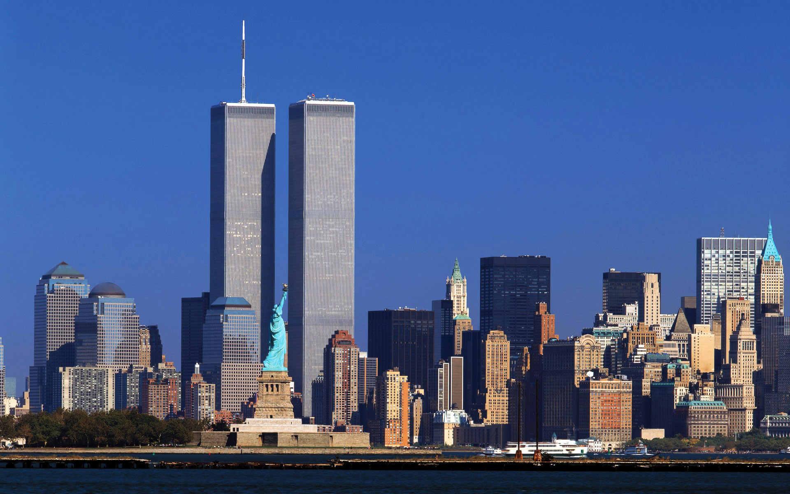
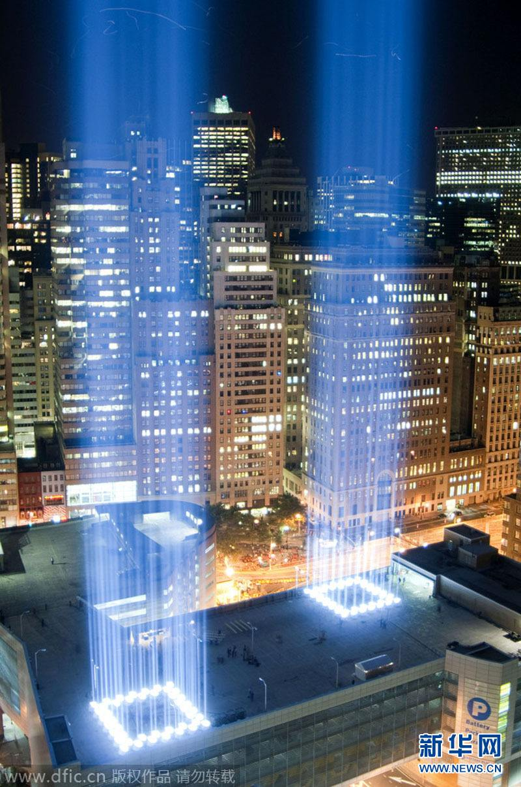
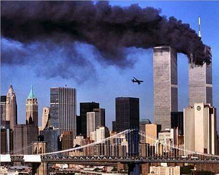
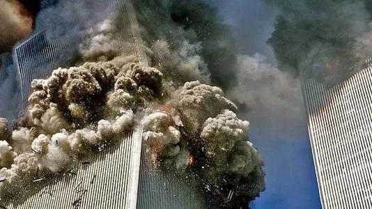
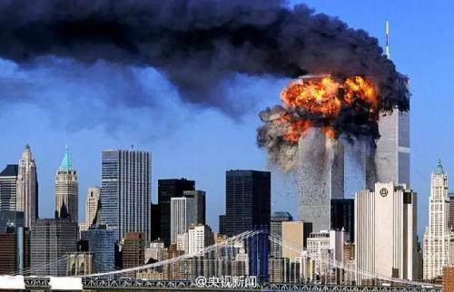

# 以史为鉴

唐太宗：夫以铜为镜，可以正衣冠；以史为镜，可以知兴替；以人为镜，可以明得失。

2001年，美国911事件，是让人痛心的。以图为示：

## 美轮美奂的历史暂态

## “美轮美奂”的纪念恒态

新华网的照片，引用记录下心情，不做商用，若觉不妥，请联系我，我删除之。

## 飞机撞楼前的暂态

## 撞击后的暂态

近一年多来，美国制裁中兴、扣留我华为公主、设置实名清单、不断限制华为，近期更是“连横合纵”围堵中国，意欲为何？

荀子说：水则载舟,水则覆舟。

中国是这个地球村中的一员，中国人民是地球村村民中的一份子。美国，作为村西头的一个老牌地主，看不得我们对村民好，和平演变我大中华失败后，借用股市、比特币等手段对我中国割韭菜失败后，恼羞成怒，发起”疯“来了。

疯，不可怕，可怕的是没有原则、毫无底线的人跟疯。

以古为鉴，以史为镜，从来没有什么救世主，也没有什么超人、钢铁侠。人民群众才是社会稳定、经济发展的坚实基础。愿地球村村民都能早日清醒，恢复和谐的邻里关系。

2020/9/11